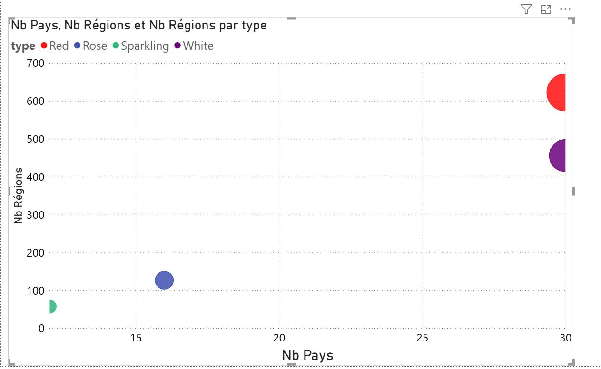
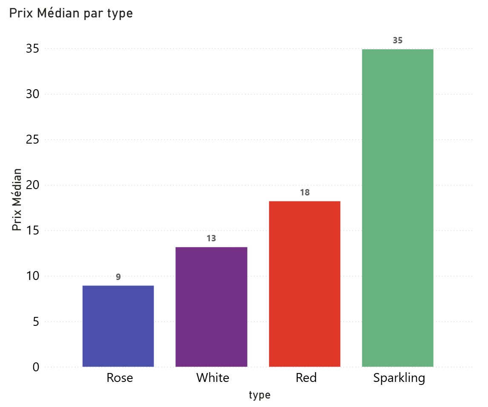
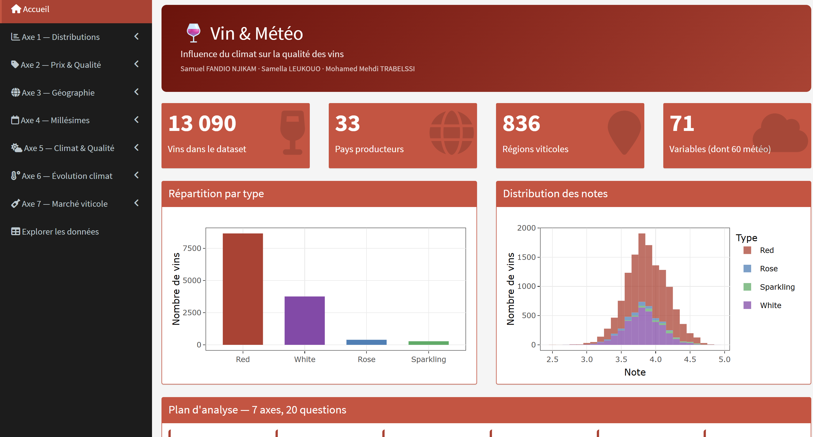
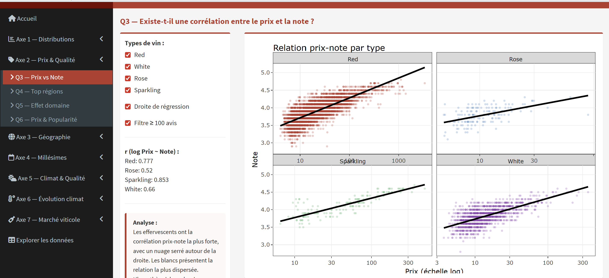
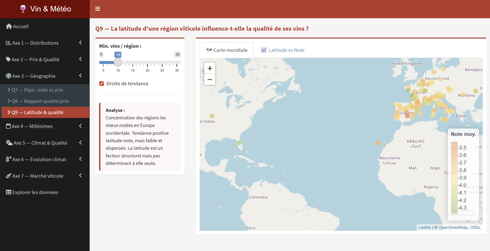
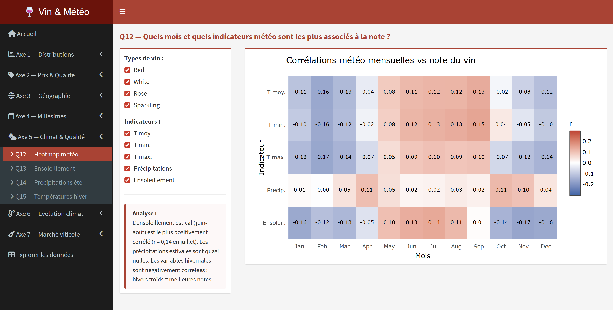

```{r setup, include=FALSE}
knitr::opts_chunk$set(echo = FALSE, warning = FALSE, message = FALSE)
```

```{css, echo=FALSE}
h1, h2, h3, h4, h5, h6 {
  color: #c0392b !important;
}

a {
  color: #c0392b !important;
}

.page-header {
  background: linear-gradient(135deg, #7b0000, #c0392b) !important;
  background-image: none !important;
}

th {
  background-color: #c0392b !important;
  color: white !important;
}

blockquote {
  border-left-color: #c0392b !important;
}
```

```{r library}
library(ggplot2)
library(dplyr)
library(scales)
library(kableExtra)
library(readr)
library(prettydoc)
library(tidyverse)
library(forcats)
library(ggrepel)
library(patchwork)
library(maps)
library(RColorBrewer)
```

```{r data}
wines <- read_csv("data/wines_merged.csv") %>%
  mutate(type = as.factor(type))
```

# Introduction

> *"Le vin est le reflet du ciel, de la terre et du travail des hommes."*

## Membres

| L'équipe Avatar         |
| --------------------    |
| Samuel FANDIO NJIKAM    |
| Samella LEUKOUO         |
| Mohamed Mehdi TRABELSSI |


### Données

Notre jeu de données est issu de la plateforme **Kaggle** : [Wine Growth Weather](https://www.kaggle.com/datasets/abcd334/wine-growth-weather/), constitué par Anton Budnyak (2020) et enrichi de données météorologiques issues de [Open-Meteo.com](https://open-meteo.com/).

Le vin est un produit intimement lié aux conditions climatiques de sa région de production. La vigne est particulièrement sensible aux variations de température, d'ensoleillement et de précipitations durant la saison de croissance. Ce dataset a précisément été conçu pour explorer cette relation : les données météorologiques correspondent à l'**année précédant la production du vin**, ce qui nous permet d'évaluer l'impact du climat sur la note et la qualité perçue du vin.

Nous avons choisi ce sujet car il croise deux domaines riches en données : l'**œnologie** et la **climatologie**. Il offre une problématique centrale claire et engageante : *les conditions météorologiques durant la saison de croissance des raisins permettent-elles de prédire la qualité d'un vin ?*

**Le dataset**

Les données se présentent initialement sous la forme de **4 fichiers CSV**, un par type de vin. Nous les avons fusionnés en un dataset unique après nettoyage, en ajoutant une colonne `type` pour distinguer les catégories.

| Type de vin | Observations |
|-------------|-------------|
| Rouge (*Red*) | 8 658 |
| Blanc (*White*) | 3 759 |
| Rosé (*Rose*) | 394 |
| Effervescent (*Sparkling*) | 279 |
| **Total fusionné** | **13 090** |

Le dataset final comporte **71 variables** et **13 090 observations**, réparties sur des vins produits entre **1961 et 2020**, dans **30 pays** et **plus de 1 200 régions viticoles**.

Les variables se regroupent en quatre grandes familles :

*Informations sur le vin (6 variables)*

| Variable | Type | Description |
|----------|------|-------------|
| `Name` | `character` | Nom du vin |
| `Country` | `character` | Pays de production |
| `Region` | `character` | Région viticole |
| `Winery` | `character` | Nom du domaine / producteur |
| `Year` | `integer` | Millésime du vin |
| `type` | `factor` | Type de vin (Red, White, Rose, Sparkling) |

*Métriques commerciales et de notation (3 variables)*

| Variable | Type | Description |
|----------|------|-------------|
| `Rating` | `double` | Note moyenne des utilisateurs (2.5 – 4.9) |
| `NumberOfRatings` | `integer` | Nombre d'évaluations reçues |
| `Price` | `double` | Prix en euros (3.55 – 3 410 €) |

*Géolocalisation (2 variables)*

| Variable | Type | Description |
|----------|------|-------------|
| `lat` | `double` | Latitude de la région de production |
| `lng` | `double` | Longitude de la région de production |

*Données météorologiques mensuelles (60 variables)*

Pour chacun des **12 mois** (Jan à Dec), 5 indicateurs climatiques sont renseignés, soit **60 colonnes** de la forme `Mois_indicateur` :

| Suffixe | Type | Description |
|---------|------|-------------|
| `_tavg` | `double` | Température moyenne (°C) |
| `_tmin` | `double` | Température minimale (°C) |
| `_tmax` | `double` | Température maximale (°C) |
| `_prcp` | `double` | Précipitations (mm) |
| `_tsun` | `double` | Durée d'ensoleillement (secondes, seuil > 120 W/m²) |

**Sous-groupes notables**

- **Par type** : 4 catégories de vins aux profils très différents en termes de volume, de région et de prix
- **Par pays** : 30 pays représentés, avec une forte dominance de la France, de l'Italie et de l'Espagne
- **Par millésime** : des vins de 1961 à 2020, pour une analyse temporelle
- **Par gamme de prix** : distribution très asymétrique, de vins d'entrée de gamme à des bouteilles d'exception

---

# Plan d'analyse

Notre analyse s'articule autour de **6 axes indépendants**, progressant du descriptif vers l'analytique et l'explicatif. Chaque question est conçue pour éclairer un aspect distinct du dataset, avec des variables, des graphiques et une approche propres.

#### Axe 1 — Distributions et structure

##### Q1 — Comment se distribuent les notes des vins, et cette distribution varie-t-elle selon le type ?

**Objectif :** Établir un portrait de base de la variable cible (`Rating`) avant toute analyse explicative. Il s'agit de comprendre si les notes sont concentrées sur une plage étroite ou bien réparties, et si les 4 types de vins présentent des profils de notation distincts.

**Variables :** `Rating`, `type`

**Graphique :** Violin plot + boxplot superposés, un par type de vin

**Approche :** On représente côte à côte les 4 distributions de `Rating` par type. Le violin plot révèle la forme complète de la distribution (asymétrie, multi-modalité), tandis que la boxplot superposée permet de lire rapidement la médiane et les quartiles. On cherchera en particulier si les effervescents ont une distribution décalée vers le haut, ou si les rosés sont plus concentrés autour d'une note moyenne.

##### Q2 — Le nombre d'évaluations est-il suffisant pour que les notes soient fiables ?

**Objectif :** Identifier un biais potentiel majeur : une note de 4.5 basée sur 30 avis est très différente d'une note de 4.5 basée sur 2 000 avis. Cette question définit un seuil de fiabilité que nous appliquerons comme filtre dans les analyses suivantes.

**Variables :** `NumberOfRatings`, `Rating`

**Graphique :** Boxplot des distributions de Rating par tranche de nombre d'avis (25–49, 50–99, 100–199, 200–499, 500–999, 1 000+)

**Approche :** On regroupe les vins en tranches croissantes de nombre d'avis et on compare la dispersion des notes (hauteur des boîtes, étendue des moustaches) entre tranches. Si les tranches basses présentent une dispersion nettement plus forte que les tranches hautes, cela confirme leur manque de fiabilité statistique. On identifie visuellement le seuil à partir duquel la dispersion se stabilise — ce seuil sera appliqué comme filtre dans les axes suivants pour garantir des comparaisons robustes.

---

#### Axe 2 — Prix, popularité et qualité

##### Q3 — Existe-t-il une corrélation entre le prix et la note, et est-elle uniforme entre les types de vins ?

**Objectif :** Tester l'hypothèse commune selon laquelle "plus un vin est cher, mieux il est noté". Cette relation est loin d'être garantie et peut varier fortement selon le type : un effervescent cher est souvent un Champagne de prestige, tandis qu'un rouge très cher peut être une bouteille de collection rarement consommée.

**Variables :** `Price`, `Rating`, `type`

**Graphique :** Scatter plot avec axe `Price` en échelle logarithmique et droite de régression par type (`geom_smooth`), facetté par `type`

**Approche :** On applique une transformation logarithmique sur `Price` pour corriger la forte asymétrie de cette variable (quelques bouteilles très chères écrasent l'axe). On trace une droite de régression par type pour comparer les pentes : une pente positive et significative valide l'hypothèse pour ce type. On s'attend à des comportements différents entre rosés (gamme de prix serrée) et rouges (gamme très large).

##### Q4 — Quelles régions viticoles produisent les vins les mieux notés en moyenne ?

**Objectif :** Identifier les *terroirs* d'excellence dans les données, indépendamment du prix. Une région peut produire des vins très bien notés à prix modéré, ou inversement des vins chers mais ordinaires.

**Variables :** `Region`, `Country`, `Rating`, `NumberOfRatings`

**Graphique :** Lollipop chart horizontal des 20 régions avec la note moyenne la plus élevée, filtré sur les régions comptant au moins 20 vins évalués, coloré par `Country`

**Approche :** On agrège le dataset par région pour calculer la note moyenne et le nombre de vins. On filtre les régions avec trop peu d'observations (seuil ≥ 20 vins, défini à partir de Q2) pour éviter les régions anecdotiques. Le lollipop chart est privilégié au bar chart car les valeurs s'échelonnent entre 3,99 et 4,37 — un bar chart depuis 0 rendrait les différences invisibles, et un bar chart tronqué introduirait un Lie Factor. Le dot encode la position (canal perceptuel le plus précis), et la couleur par pays révèle si les meilleures régions sont concentrées dans un même pays ou dispersées géographiquement.

##### Q5 — Certains producteurs se distinguent-ils par une note systématiquement supérieure à celle de leur région ?
 
**Objectif :** Mesurer l'effet *domaine* sur la qualité, c'est-à-dire la part de la note qui s'explique par le savoir-faire du producteur plutôt que par son terroir. Une région peut afficher une note moyenne élevée simplement parce qu'un ou deux grands domaines tirent la moyenne vers le haut — cette question permet de détecter ce phénomène et de distinguer l'excellence d'un terroir de celle d'un producteur.
 
**Variables :** `Winery`, `Region`, `Rating`, `type`
 
**Graphique :** Dot plot des 20 producteurs dont l'écart entre leur note moyenne et la note moyenne de leur région est le plus élevé, coloré par `type`, avec barres d'erreur représentant l'intervalle de confiance
 
**Approche :** Pour chaque vin, on calcule l'écart entre sa note et la note moyenne de sa région (`Rating - mean_rating_region`). On agrège ensuite par `Winery` pour obtenir l'écart moyen par producteur, filtré sur ceux ayant au moins 10 vins notés. Un écart positif élevé indique un producteur qui surperforme structurellement son terroir. Le dot plot avec intervalles de confiance permet de distinguer les producteurs dont la surperformance est statistiquement solide de ceux dont l'écart est dû à un trop faible nombre d'observations.

##### Q6 — Les vins chers sont-ils aussi les plus populaires, et cette relation se reflète-t-elle dans la note ?
 
**Objectif :** Explorer la relation entre positionnement tarifaire (`Price`) et popularité (`NumberOfRatings`), puis observer comment la note se distribue dans ces deux dimensions.
 
**Variables :** `Price`, `NumberOfRatings`, `Rating`, `type`
 
**Graphique :** Scatter plot `log(Price)` vs `log(NumberOfRatings)`, coloré par `Rating`, avec lignes médianes délimitant 4 quadrants, facetté par `type`
 
**Approche :** On applique des transformations logarithmiques sur les deux axes.

---

#### Axe 3 — Profil géographique et comparaison internationale
 
##### Q7 — Quels pays produisent les vins les mieux notés, et à quel prix ?
 
**Objectif :** Comparer les grands pays producteurs (12 pays avec ≥ 100 vins) sur leur positionnement simultané en note et en prix. Cette question adopte une granularité nationale, qui revèle des stratégies de marché différentes : la France produit cher (médiane 27€) là où le Portugal produit abordable (11€) pour des notes similaires.
 
**Variables :** `Country`, `Rating`, `Price` — variable construite : `Continent`

**Graphique :** Scatter plot des pays (`price_med` en x, `rating_med` en y), coloré par continent, avec annotation des noms de pays
 
**Approche :** On agrège par pays (filtre ≥ 100 vins, 12 pays exploitables). Chaque pays devient un point sur le graphique prix/note. On identifiera les pays à fort rapport qualité/prix (Portugal, Espagne, Chili) vs. les pays premium (France, États-Unis).
 
##### Q8 — Quel type de vin offre le meilleur rapport qualité/prix, et dans quels pays ce rapport est-il le plus favorable ?
 
**Objectif :** Construire un indicateur synthétique de rapport qualité/prix (`Rating / log(Price)`) pour comparer les types de vins et les pays de production sur une dimension unique. Question qui combine prix et note en un seul score et le compare entre groupes.
 
**Variables :** `Rating`, `Price`, `type`, `Country`
 
**Graphique :** Bar chart double : d'abord par `type`, puis par `Country` (top 8 pays), ce qui montrerait le score qualité/prix moyen avec barres d'erreur
 
**Approche :** On construit `qp_ratio = Rating / log(Price + 1)` (qp = qualité_prix).
 
##### Q9 — La latitude d'une région viticole influence-t-elle la qualité structurelle de ses vins ?
 
**Objectif :** Explorer si la position géographique d'une région (qui détermine structurellement son ensoleillement et ses températures moyennes) est associée à la qualité moyenne des vins produits, indépendamment des variations annuelles.
 
**Variables :** `lat`, `lng`, `Rating`, `NumberOfRatings`

**Graphique :** Carte géographique (`ggplot2` + `geom_point`) où chaque région est positionnée par `lat`/`lng`, colorée par note moyenne ; complétée d'un scatter plot `lat` vs `Rating` avec droite de régression
 
**Approche :** On agrège les données par région pour obtenir la note moyenne et le nombre de vins (filtre ≥ 10 vins par région). On projette chaque région sur une carte du monde pour révéler des patterns spatiaux visuels. Le scatter plot complémentaire `lat` vs note moyenne quantifie la tendance et ajoute une droite de régression pour mesurer l'effet de la latitude.
 
---

#### Axe 4 — Millésimes et effet du temps

##### Q10 — La note moyenne des vins a-t-elle évolué sur la période (2005–2019), et ce phénomène est-il homogène entre les types ?

**Objectif :** Observer si la qualité perçue des vins, mesurée par leur note moyenne, évolue au fil des millésimes récents. Et la tendance d'évolution est partagée par tous les types de vins ou si certains se distinguent.

**Variables :** `Year`, `Rating`, `type`

**Graphique :** Line chart de la note moyenne par millésime (2005–2019) avec bande de confiance (`geom_ribbon`), facetté par `type`

**Approche :** On agrège les notes par année et par type sur la période 2005–2019. On trace l'évolution avec une bande de confiance proportionnelle au nombre d'observations. On compare les pentes entre types pour voir si certains résistent mieux à cette tendance que d'autres.

##### Q11 — Certaines régions viticoles sont-elles plus régulières que d'autres d'une année à l'autre ?
 
**Objectif :** Comparer les régions non plus sur leur note moyenne (comme en Q4) mais sur leur *régularité* : une région peut être excellente en moyenne mais capricieuse selon les millésimes, tandis qu'une autre produit des vins d'une qualité constante. 
 
**Variables :** `Region`, `Year`, `Rating`, `Country` — variable construite : `std_rating_region`
 
**Graphique :** Bar chart des 15 régions les plus stables vs les 15 plus capricieuses (classées par `std_rating_region`), coloré par `Country`
 
**Approche :** On filtre les régions ayant ≥ 5 millésimes distincts. Pour chaque région, on calcule l'écart-type des notes par année. Le bar chart comparatif révèle quelles régions (et quels pays) produisent les vins les plus prévisibles vs. les plus variables d'une année à l'autre.

---

#### Axe 5 — Climat et qualité : le cœur de la problématique

##### Q12 — Sur l'ensemble du calendrier climatique annuel, quels mois et quels indicateurs météo sont les plus associés à la note du vin ?

**Objectif :** Dresser une cartographie complète et sans a priori des corrélations entre les 60 variables météo mensuelles et la note du vin. L'objectif est exploratoire : plutôt que de tester une hypothèse précise, on laisse les données révéler quelles périodes de l'année climatique (pas nécessairement l'été) et quels indicateurs (température, ensoleillement, précipitations) sont les plus liés à la qualité perçue. Cette question sert de boussole pour les analyses suivantes.

**Variables :** `Rating` et les 60 variables météo mensuelles (`Jan_tavg` à `Dec_tsun`)

**Graphique :** Heatmap de corrélation, avec les 12 mois sur l'axe x et les 5 indicateurs météo (`tavg`, `tmin`, `tmax`, `prcp`, `tsun`) sur l'axe y, la couleur encodant le coefficient de corrélation de Pearson avec `Rating`

**Approche :** On calcule le coefficient de corrélation de Pearson entre `Rating` et chacune des 60 variables météo. La heatmap permet de visualiser en un coup d'œil les zones de corrélation forte et faible sur l'ensemble du calendrier. On laisse les résultats guider l'interprétation plutôt que de confirmer une hypothèse préétablie.

##### Q13 — L'ensoleillement estival prédit-il mieux la note que l'ensoleillement printanier, et cet effet varie-t-il selon le type de vin ?

**Objectif :** Comparer le pouvoir prédictif de deux périodes climatiques distinctes (le printemps (floraison de la vigne, avril-juin) et l'été (maturation des raisins, juillet-septembre)) sur la note finale. 

**Variables :** `Apr_tsun`, `May_tsun`, `Jun_tsun`, `Jul_tsun`, `Aug_tsun`, `Sep_tsun`, `Rating`, `type`

**Graphique :** Scatter plot facetté par `type` avec deux courbes `geom_smooth` superposées — une pour `tsun_print` (printemps) et une pour `tsun_ete` (été) — colorées différemment

**Approche :** On construit `tsun_print` (moyenne avril-juin) et `tsun_ete` (moyenne juillet-septembre). On trace les deux relations sur le même graphique par type. La comparaison des pentes révèle quelle période compte le plus pour chaque type de vin. On s'attend à ce que l'été soit plus déterminant, bien que les deux saisons puissent se révéler similaires selon le type.

##### Q14 — Les précipitations estivales ont-elles un effet négatif sur la note des vins effervescents, et comment cet effet se compare-t-il aux autres types ?

**Objectif :** Examiner si les précipitations estivales influencent différemment la note selon le type de vin. Les vins effervescents, issus majoritairement de régions fraîches (Champagne, Crémant, Cava), sont réputés particulièrement sensibles à l'excès d'humidité qui nuit à la concentration des arômes. Cette question analyse un mécanisme différent (l'excès d'eau) et permet de comparer la sensibilité aux précipitations entre les 4 types de vins.

**Variables :** `Jul_prcp`, `Aug_prcp`, `Sep_prcp`, `Rating`, `type`

**Graphique :** Scatter plot `prcp_ete` vs `Rating` avec `geom_smooth` (méthode *loess*), facetté par `type`, pour comparer visuellement les pentes et formes de relation entre types

**Approche :** On construit une variable `prcp_ete` (somme des précipitations de juillet à septembre). On trace la relation avec `Rating` séparément pour chaque type via un facettage. 

##### Q15 — Une température hivernale plus froide est-elle associée à de meilleures notes, particulièrement pour les vins blancs ?
 
**Objectif :** Explorer l'effet des températures hivernales sur la qualité du vin. Question distincte des axes estivaux car elle porte sur le repos végétatif de la vigne (décembre-février).
 
**Variables :** `Dec_tavg`, `Jan_tavg`, `Feb_tavg`, `Rating`, `type`
 
**Graphique :** Scatter plot `tavg_hiver` vs `Rating` avec `geom_smooth` par type, facetté par `type`
 
**Approche :** On construit `tavg_hiver` (moyenne décembre-février). On compare la relation avec `Rating` entre types.

---

#### Axe 6 — Évolution climatique

##### Q16 — La hausse des températures estivales liée au réchauffement climatique est-elle visible dans les régions viticoles méditerranéennes entre 2005 et 2019 ?

**Objectif :** Vérifier si le réchauffement climatique laisse une trace mesurable dans les données météo du dataset, en se concentrant sur la zone méditerranéenne (latitude 35°–45°N) où le signal est le plus net et le plus documenté scientifiquement. Cette question porte *uniquement sur les variables météo*, sans impliquer la note; elle valide la cohérence du dataset avec les données climatiques officielles et donne de la crédibilité aux analyses de l'axe 4.

**Variables :** `Year`, `Jul_tavg`, `Aug_tavg`, `Sep_tavg`, `lat`

**Graphique :** Line chart de la température estivale moyenne par année (2005–2019) pour les régions méditerranéennes (35°N < `lat` < 45°N), avec droite de tendance linéaire (`geom_smooth`, méthode *lm*) et bande de confiance

**Approche :** On filtre les vins des régions situées entre 35° et 45° de latitude nord (Espagne, Sud de la France, Italie, Grèce). On agrège la température estivale moyenne (`tavg_ete`) par année.

---

#### Axe 7 — Structure et diversité du marché viticole
 
##### Q17 — Quel est le profil de diversité géographique de chaque type de vin, et comment cela se reflète-t-il dans leurs gammes de prix ?
 
**Objectif :** Comparer les 4 types de vins sur leur empreinte géographique (nombre de pays et de régions couverts) et leur positionnement tarifaire.
 
**Variables :** `type`, `Country`, `Region`, `Price`
 
**Graphique :** Scatter plot avec le nombre de pays en x, le nombre de régions en y, la couleur encodant le type (points de taille fixe — la diversité géographique est encodée par la position x/y) ; complété d'un bar chart horizontal des prix médians par type (encodage par longueur)
 
**Approche :** On agrège par type pour obtenir le nombre de pays distincts, de régions distinctes et le prix médian. Le scatter plot positionne chaque type dans l'espace diversité (nb pays × nb régions) ; le bar chart complémentaire lit le prix médian par longueur, encodage perceptuellement supérieur à la taille des bulles.

##### Q18 — La variabilité des notes au sein d'un même pays reflète-t-elle une hétérogénéité de production ou une richesse de terroirs ?
 
**Objectif :** Comparer les pays non sur leur note moyenne (comme en Q7) mais sur leur *dispersion* interne (`std` des notes). Un pays avec une forte dispersion produit à la fois de très bons et de très mauvais vins (profil hétérogène), tandis qu'un pays homogène maintient un niveau constant.
 
**Variables :** `Country`, `Rating`

**Graphique :** Bar chart horizontal des pays (≥ 100 vins) classés par écart-type des notes, avec la note moyenne annotée sur chaque barre, la couleur encodant la note moyenne (gradient séquentiel)
 
**Approche :** On calcule la note moyenne et l'écart-type par pays. On trie par écart-type décroissant. On annote la note moyenne sur chaque barre pour lire simultanément qualité moyenne et régularité. Les pays "surprises" (bonne moyenne + forte dispersion) seront les plus intéressants à commenter.

##### Q19 — Quelles régions surperforment en note tout en restant moins chères que la moyenne du pays ?
 
**Objectif :** Identifier les régions qui combinent deux avantages : une note supérieure à la moyenne nationale ET un prix inférieur à la médiane nationale. Ce sont les "pépites" du dataset, des terroirs d'excellence accessibles. Question qui croise note, prix et ancrage géographique.
 
**Variables :** `Region`, `Country`, `Rating`, `Price`
 
**Graphique :** Scatter plot des régions (≥ 15 vins) avec `ecart_note_pays` en x et `ecart_prix_pays` en y, annoté pour les régions dans le quadrant "mieux notées + moins chères", coloré par `Country`
 
**Approche :** Pour chaque région, on calcule l'écart à la note moyenne nationale et l'écart au prix médian national. On projette chaque région sur le plan (écart_note, écart_prix). Le quadrant inférieur droit (écart_note > 0, écart_prix < 0 : meilleure note ET moins cher) identifie les pépites.

##### Q20 — Le profil climatique annuel d'une région permet-il de prédire la régularité de sa production d'une année à l'autre ?
 
**Objectif :** Tester si les régions au climat annuel plus stable (faible variabilité de la température estivale d'une année à l'autre) produisent des vins avec des notes plus homogènes entre millésimes. Question conclusive qui relie les axes climatiques (Axe 5) et la stabilité de production (Q11), ce qui cloture la problématique centrale du projet.
 
**Variables :** `Region`, `Year`, `Rating`, `Jul_tavg`, `Aug_tavg`, `Sep_tavg` — variables construites : `std_rating_region`, `std_tavg_region`
 
**Graphique :** Scatter plot `std_tavg_region` (variabilité climatique) vs `std_rating_region` (variabilité des notes) avec les régions comme points colorés par `Country`, annoté pour les cas extrêmes, avec droite de tendance
 
**Approche :** On filtre les régions avec ≥ 5 millésimes. On calcule l'écart-type de la note et de la température estivale par région. Le scatter plot teste visuellement la corrélation entre stabilité climatique et stabilité qualitative. La visualisation obtenue permettra d'ouvrir sur les limites du seul facteur climatique pour expliquer la régularité d'une production viticole.
 
---

#### Points de vigilance

- La **note est subjective** et agrégée sur des périodes différentes ; un vin de 1990 noté aujourd'hui souffre d'un biais de sélection (seules les bonnes bouteilles survivent et sont encore notées)
- La **météo est géolocalisée à l'échelle de la région** et non de la parcelle : des micro-climats peuvent exister au sein d'une même région sans être capturés
- La **forte asymétrie par type** (8 658 rouges vs 279 effervescents) limitera la comparabilité directe entre catégories sans rééchantillonnage ou pondération
- Certaines variables météo sont **colinéaires** (`tmin`, `tmax`, `tavg` sont par définition liées), ce qui sera pris en compte pour éviter les interprétations redondantes dans les analyses multivariées
- Le dataset ne contient **aucune information sur les pratiques viticoles** (agriculture biologique, irrigation, rendement), ce qui laisse une part de variance inexpliquée par le seul climat

---

# Exploration

## Axe 1 — Distributions et structure

### Q1 — Comment se distribuent les notes des vins, et cette distribution varie-t-elle selon le type ?

Avant toute analyse explicative, nous observons la distribution brute de la variable cible `Rating` pour chaque type de vin. Cette visualisation est réalisée sur l'ensemble du dataset, avant l'application du filtre de fiabilité défini en Q2.

```{r q1_distribution_notes, fig.width=9, fig.height=5}
ggplot(wines, aes(x = type, y = Rating, fill = type)) +
  geom_violin(alpha = 0.55, trim = FALSE) +
  geom_boxplot(width = 0.12, fill = "white", alpha = 0.85,
               outlier.size = 0.4, outlier.alpha = 0.3) +
  scale_fill_brewer(palette = "Set1", guide = "none") +
  scale_y_continuous(limits = c(2.0, 5.2), breaks = seq(2.5, 5.0, by = 0.25)) +
  labs(
    title    = "Distribution des notes par type de vin",
    subtitle = "Violin plot + boxplot superposés — dataset complet (avant filtrage)",
    x        = "Type de vin",
    y        = "Note (Rating)"
  ) +
  theme_bw() +
  theme(
    plot.title    = element_text(face = "bold", size = 13),
    plot.subtitle = element_text(size = 10, color = "grey40")
  )
```
**Analyse**

Les quatre types n'affichent pas des médianes aussi proches que prévu : elles vont de 3,75 pour les rosés à 4,10 pour les effervescents. Ces derniers se démarquent clairement avec une distribution décalée vers le haut et plus resserrée, signe d'une qualité perçue globalement supérieure et plus homogène. Les rouges se positionnent légèrement au-dessus des blancs et des rosés, ces trois types partageant néanmoins des queues basses similaires. Ces différences justifient le recours systématique à des segmentations par type dans les analyses suivantes.

---

### Q2 — Le nombre d'évaluations est-il suffisant pour que les notes soient fiables ?

  Une note de 4,5 sur 30 avis ne vaut pas une note de 4,5 sur 2 000 avis.C'est une évidence statistique, mais encore faut-il la quantifier sur notre dataset. Avant toute comparaison, nous devons donc nous demander : **à partir de combien d'avis une note devient-elle réellement représentative ?** On s'attend à observer une forte dispersion des notes pour les vins peu évalués, qui se stabilisera progressivement avec l'augmentation du nombre d'avis.

```{r q2_fiabilite_notes, fig.width=10, fig.height=6}
wines_q2 <- wines %>%
  mutate(tranche_avis = cut(
    NumberOfRatings,
    breaks = c(25, 50, 100, 200, 500, 1000, Inf),
    labels = c("25–49", "50–99", "100–199", "200–499", "500–999", "1 000+"),
    right  = FALSE
  ))

ggplot(wines_q2, aes(x = tranche_avis, y = Rating)) +
  geom_boxplot(
    aes(fill = tranche_avis),
    outlier.size  = 0.4,
    outlier.alpha = 0.3,
    width = 0.6
  ) +
  # Zone peu fiable
  annotate("rect", xmin = 0.5, xmax = 2.5, ymin = -Inf, ymax = Inf,
           fill = "#e74c3c", alpha = 0.07) +
  annotate("rect", xmin = 2.5, xmax = 6.5, ymin = -Inf, ymax = Inf,
           fill = "#27ae60", alpha = 0.07) +
  annotate("text", x = 1.5, y = 4.85, label = "Zone peu fiable",
           color = "#c0392b", size = 3.5, fontface = "bold") +
  annotate("text", x = 4.5, y = 4.85, label = "Zone retenue (≥ 100 avis)",
           color = "#27ae60", size = 3.5, fontface = "bold") +
  geom_vline(xintercept = 2.5, linetype = "dashed",
             color = "grey20", linewidth = 0.9) +
  scale_fill_brewer(palette = "Blues", guide = "none") +
  scale_y_continuous(breaks = seq(2.5, 5.0, by = 0.25)) +
  labs(
    title    = "Fiabilité des notes selon le nombre d'évaluations",
    subtitle = "La dispersion (hauteur des boîtes) se réduit nettement à partir de 100 avis",
    x        = "Tranche de nombre d'avis",
    y        = "Note moyenne"
  ) +
  theme_bw() +
  theme(
    plot.title    = element_text(face = "bold", size = 13),
    plot.subtitle = element_text(size = 10, color = "grey40")
  )
```
**Analyse**

  La fiabilité d'une note est directement liée au volume d'évaluations : en dessous de 100 avis, la dispersion reste trop élevée pour être exploitable et reflète davantage une opinion restreinte qu'un consensus. A partir de ce seuil, les distributions convergent et se stabilisent, signalant que la note est représentative. **Nous retenons donc 100 avis comme filtre de fiabilité pour toutes les analyses suivantes**, ce qui couvre un peu plus de la moitié du dataset. A noter que les vins très médiatisés (tranche 1 000+) voient leur dispersion légèrement remonter, non par manque de fiabilité, mais parce qu'ils polarisent davantage les opinions entre admirateurs et sceptiques.

---

## Axe 2 — Prix, popularité et qualité
### Q3 — Existe-t-il une corrélation entre le prix et la note, et varie-t-elle selon le type de vin ?

Le prix d’un vin est souvent associé à sa qualité, mais cette relation n’est pas toujours évidente dans la réalité. Certains vins très chers ne sont pas forcément mieux notés, tandis que d’autres offrent une excellente qualité pour un prix bien plus accessible. Il est donc intéressant de vérifier s’il existe réellement un lien entre le prix et la note, et surtout si ce lien varie selon le type de vin (rouge, blanc, rosé, effervescent).

On s’attend globalement à une relation positive entre le prix et la note, mais avec des différences selon les catégories. Les vins rouges et effervescents devraient montrer une corrélation plus marquée, tandis que les blancs et les rosés pourraient présenter une relation plus faible ou plus dispersée.
```{r q3_price_rating, fig.width=10, fig.height=6}

df_clean <- wines %>%
  filter(!is.na(Price), !is.na(Rating))

ggplot(df_clean, aes(x = Price, y = Rating, color = type)) +
  geom_point(alpha = 0.4) +
  scale_x_log10() +
  geom_smooth(method = "lm", se = FALSE, color = "black", linewidth = 0.9) +
  facet_wrap(~type) +
  labs(
    title    = "Relation entre le prix et la note des vins selon le type",
    subtitle = "Analyse de la corrélation prix–qualité avec échelle logarithmique",
    x        = "Prix (échelle logarithmique)",
    y        = "Note (Rating)"
  ) +
  theme_bw() +
  theme(
    plot.title    = element_text(face = "bold", size = 13),
    plot.subtitle = element_text(size = 10, color = "grey40")
  )


```
**Analyse**

La corrélation entre prix et note est positive pour tous les types, mais son intensité varie. C'est paradoxalement chez les effervescents qu'elle est la plus forte, avec un nuage particulièrement serré autour de la droite, et non chez les rouges comme on aurait pu l'anticiper. Les rouges présentent néanmoins un signal clair grâce à leur large gamme de prix. Les blancs présentent la relation la plus dispersée autour de la droite, indiquant que le prix y est un indicateur de qualité moins fiable. En somme, l'hypothèse "cher = bon" se vérifie dans toutes les catégories, mais avec une intensité variable.

### Q4 — Quelles régions viticoles produisent les vins les mieux notés en moyenne ?

On cherche à identifier les terroirs d’excellence dans les données, en filtrant les régions avec trop peu d’observations pour éviter les résultats anecdotiques. Les notes varient toutes entre 3,99 et 4,37 — une plage très étroite qui rend un bar chart depuis 0 illisible et un bar chart tronqué trompeur (Lie Factor). Le lollipop chart (dot + segment) est ici le bon choix : le dot encode la position (canal le plus précis selon la hiérarchie de Bertin), et la couleur par pays révèle si l’excellence se concentre géographiquement.

```{r q4_regions_top, fig.width=11, fig.height=7}
wines_filtered <- wines %>% filter(NumberOfRatings >= 100)

region_stats_q4 <- wines_filtered %>%
  filter(!is.na(Region), !is.na(Rating), !is.na(Country)) %>%
  group_by(Region, Country) %>%
  summarise(
    n_wines     = n(),
    mean_rating = mean(Rating, na.rm = TRUE),
    .groups     = "drop"
  ) %>%
  filter(n_wines >= 20) %>%
  slice_max(order_by = mean_rating, n = 20)

ggplot(region_stats_q4,
       aes(y = reorder(Region, mean_rating))) +
  geom_segment(aes(x = 3.95, xend = mean_rating,
                   yend = reorder(Region, mean_rating)),
               color = "grey70", linewidth = 0.6) +
  geom_point(aes(x = mean_rating, color = Country), size = 4) +
  geom_text(aes(x = mean_rating, label = round(mean_rating, 2)),
            hjust = -0.4, size = 3) +
  scale_color_manual(
    values = colorRampPalette(brewer.pal(12, "Paired"))(n_distinct(region_stats_q4$Country)),
    name = "Pays"
  ) +
  scale_x_continuous(limits = c(3.95, 4.52)) +
  labs(
    title    = "Top 20 regions viticoles par note moyenne",
    subtitle = "Régions avec au moins 20 vins évalués (filtre 100 avis par vin)",
    x        = "Note moyenne",
    y        = NULL
  ) +
  theme_bw() +
  theme(
    plot.title    = element_text(face = "bold", size = 13),
    plot.subtitle = element_text(size = 10, color = "grey40"),
    legend.position = "right"
  )
```

**Analyse**

Les meilleures régions affichent des notes moyennes au-dessus de 4,2, ce qui est significatif sur une échelle aussi resserrée. La France domine le classement devant l'Italie, confirmant la prédominance des terroirs d'Europe occidentale dans la perception internationale de la qualité viticole. Cette concentration géographique de l'excellence montre que le terroir, au sens large, reste un déterminant fort de la qualité perçue, indépendamment du type de vin ou du prix.

---

### Q5 — Certains producteurs se distinguent-ils par une note systématiquement supérieure à celle de leur région ?

Certaines régions viticoles doivent leur excellente réputation non pas à leur terroir dans son ensemble, mais à un ou deux domaines d'exception qui tirent la moyenne vers le haut. Cette question cherche à isoler l'**effet domaine** : la part de la note qui s'explique par le savoir-faire du producteur, indépendamment de sa région.

On s'attend à trouver quelques producteurs avec un écart positif marqué et statistiquement solide, concentrés dans des types bien précis (majoritairement des rouges), tandis que d'autres auront un écart élevé mais incertain dû à un faible nombre de vins notés.

```{r q5_effet_domaine, fig.width=10, fig.height=7}
# Calcul de la note moyenne par région
region_avg <- wines %>%
  group_by(Region) %>%
  summarise(mean_rating_region = mean(Rating, na.rm = TRUE), .groups = "drop")

# Calcul de l'écart producteur vs région
df_q5 <- wines %>%
  filter(!is.na(Rating), !is.na(Winery), !is.na(Region)) %>%
  left_join(region_avg, by = "Region") %>%
  mutate(ecart = Rating - mean_rating_region)

# Agrégation par producteur (min 10 vins)
winery_stats <- df_q5 %>%
  group_by(Winery, type) %>%
  summarise(
    n         = n(),
    ecart_moy = mean(ecart, na.rm = TRUE),
    se        = sd(ecart, na.rm = TRUE) / sqrt(n()),
    .groups   = "drop"
  ) %>%
  filter(n >= 10) %>%
  slice_max(order_by = ecart_moy, n = 20)

ggplot(winery_stats, aes(x = ecart_moy, y = reorder(Winery, ecart_moy), color = type)) +
  geom_point(size = 3) +
  geom_errorbarh(
    aes(xmin = ecart_moy - 1.96 * se,
        xmax = ecart_moy + 1.96 * se),
    height = 0.3, linewidth = 0.6
  ) +
  geom_vline(xintercept = 0, linetype = "dashed", color = "grey40") +
  scale_color_brewer(palette = "Set1", name = "Type de vin") +
  labs(
    title    = "Top 20 producteurs surperformant leur région",
    subtitle = "Écart entre la note moyenne du producteur et la note moyenne de sa région (≥ 10 vins)",
    x        = "Écart moyen à la note de la région",
    y        = NULL,
    caption  = "Barres d'erreur = intervalle de confiance à 95%"
  ) +
  theme_bw() +
  theme(
    plot.title    = element_text(face = "bold", size = 13),
    plot.subtitle = element_text(size = 10, color = "grey40"),
    legend.position = "bottom"
  )
```

**Analyse**

Oui, clairement : certains producteurs affichent un écart à la note régionale systématiquement positif, et la majorité des intervalles de confiance excluent zéro, ce qui confirme que cette surperformance ne doit rien au hasard. Ces domaines illustrent bien l'effet domaine, c'est-à-dire que le savoir-faire d'un vigneron peut faire une vraie différence, même dans une région de réputation ordinaire. Les rouges dominent le classement, ce qui s'explique avant tout par leur forte surreprésentation dans le dataset et par l'amplitude de qualité plus grande dans cette catégorie. Quelques producteurs affichent un écart élevé mais avec de larges barres d'erreur, ce qui invite à rester prudent : leur surperformance repose sur trop peu de vins pour être conclusive.

### Q6 — Les vins chers sont-ils aussi les plus populaires, et cette relation se reflète-t-elle dans la note ?

Un vin cher est-il nécessairement un vin populaire ? On pourrait le penser : un grand cru reconnu attire naturellement les amateurs et accumule les évaluations. Mais l'hypothèse inverse est tout aussi plausible : les vins très accessibles, achetés en masse, seraient davantage notés que les vins d'exception, rares et confidentiels.

Nous appliquons une transformation logarithmique sur `Price` et `NumberOfRatings`, dont les distributions sont très asymétriques, quelques bouteilles à plus de 1 000 € ou 50 000 avis écraserait l'ensemble du nuage sans cette correction. Deux lignes médianes 
délimitent quatre quadrants de lecture. Le graphique est facetté par `type` car les dynamiques prix/popularité diffèrent structurellement entre un rouge de Bordeaux et un effervescent de supermarché.

```{r q6_prix_popularite, fig.width=11, fig.height=7}
df_q6 <- wines %>%
  filter(!is.na(Price), !is.na(NumberOfRatings), !is.na(Rating),
         Price > 0, NumberOfRatings > 0) %>%
  mutate(
    log_price = log10(Price),
    log_pop   = log10(NumberOfRatings),
    type = fct_relevel(type, "Red", "White", "Rose", "Sparkling")
  )

medians <- df_q6 %>%
  group_by(type) %>%
  summarise(med_price = median(log_price),
            med_pop   = median(log_pop),
            .groups   = "drop")

ggplot(df_q6, aes(x = log_price, y = log_pop, color = Rating)) +
  geom_point(alpha = 0.3, size = 1.1) +
  geom_vline(data = medians, aes(xintercept = med_price),
             linetype = "dashed", color = "grey40", linewidth = 0.5) +
  geom_hline(data = medians, aes(yintercept = med_pop),
             linetype = "dashed", color = "grey40", linewidth = 0.5) +
  scale_color_gradientn(
    colours = c("#d73027", "#fee08b", "#1a9850"),
    name = "Note", limits = c(2.5, 5)
  ) +
  scale_x_continuous(
    name   = "Prix (€, échelle log)",
    breaks = log10(c(5, 10, 50, 100, 500, 1000)),
    labels = c("5", "10", "50", "100", "500", "1 000")
  ) +
  scale_y_continuous(
    name   = "Nombre d'évaluations (échelle log)",
    breaks = log10(c(25, 100, 500, 1000, 5000, 20000)),
    labels = c("25", "100", "500", "1k", "5k", "20k")
  ) +
  facet_wrap(~ type, scales = "free", ncol = 2) +
  labs(
    title    = "Prix, popularité et note : quatre profils de vins",
    subtitle = "Pointillés = médianes par type. Couleur = note moyenne.",
    caption  = "Source : Kaggle — Wine Growth Weather (Anton Budnyak, 2020)"
  ) +
  theme_bw(base_size = 11) +
  theme(
    plot.title      = element_text(face = "bold", size = 13),
    plot.subtitle   = element_text(size = 10, color = "grey40"),
    strip.text      = element_text(face = "bold"),
    legend.position = "bottom",
    legend.key.width = unit(1.5, "cm"),
    panel.grid.minor = element_blank()
  )
```
**Analyse**

Le graphique montre que prix et popularité ne suivent pas de logique linéaire claire, mais les extrêmes sont parlants : les volumes d'évaluations les plus élevés se concentrent sur les vins les moins chers, achetés et notés en masse, tandis que les vins chers restent peu évalués mais tendent à être mieux notés (teinte verte), ce qui suggère une logique de prestige. Le marché viticole se scinde donc en deux dynamiques opposées : volume pour les uns, qualité confidentielle pour les autres. Il faut garder à l'esprit que `NumberOfRatings` mesure une diffusion commerciale et non une vraie notoriété, ce qui renforce la pertinence du filtre à 100 avis établi en Q2 pour la suite du rapport.

---

## Axe 3 — Profil géographique et comparaison internationale

### Q7 — Quels pays produisent les vins les mieux notés, et à quel prix ?

On compare les grands pays producteurs sur deux dimensions simultanées : note médiane et prix médian. Le scatter plot est ici plus efficace qu'un simple bar chart car il positionne chaque pays dans un espace bidimensionnel, révélant des stratégies de marché différentes. La couleur distingue les continents, et chaque point est étiqueté pour identifier directement le pays.

```{r q7_pays_note_prix, fig.width=10, fig.height=7}
continent_lookup <- tibble(
  Country   = c("France","Italy","Spain","Portugal","Germany","Austria",
                "Switzerland","Greece","Hungary","Romania","Moldova",
                "Georgia","Bulgaria","Croatia","Slovenia",
                "United States","Argentina","Chile","Uruguay","Brazil",
                "Australia","New Zealand",
                "South Africa",
                "Israel","Lebanon","Turkey","China","Japan"),
  Continent = c("Europe","Europe","Europe","Europe","Europe","Europe",
                "Europe","Europe","Europe","Europe","Europe",
                "Europe","Europe","Europe","Europe",
                "Ameriques","Ameriques","Ameriques","Ameriques","Ameriques",
                "Oceanie","Oceanie",
                "Afrique",
                "Asie","Asie","Asie","Asie","Asie")
)

wines_filtered <- wines %>% filter(NumberOfRatings >= 100)

country_stats_q7 <- wines_filtered %>%
  filter(!is.na(Country), !is.na(Rating), !is.na(Price), Price > 0) %>%
  group_by(Country) %>%
  summarise(
    n_wines    = n(),
    rating_med = median(Rating, na.rm = TRUE),
    price_med  = median(Price, na.rm = TRUE),
    .groups    = "drop"
  ) %>%
  filter(n_wines >= 100) %>%
  left_join(continent_lookup, by = "Country") %>%
  mutate(Continent = replace_na(Continent, "Autre"))

ggplot(country_stats_q7,
       aes(x = price_med, y = rating_med,
           color = Continent, label = Country)) +
  geom_point(size = 4, alpha = 0.85) +
  geom_text_repel(size = 3.2, show.legend = FALSE) +
  scale_color_brewer(palette = "Set1", name = "Continent") +
  scale_x_log10(labels = function(x) paste0(x, "€")) +
  labs(
    title    = "Positionnement des pays producteurs : note vs prix médians",
    subtitle = "Pays avec au moins 100 vins évalués (filtre 100 avis). Prix en échelle log.",
    x        = "Prix médian (EUR, échelle log)",
    y        = "Note médiane"
  ) +
  theme_bw() +
  theme(
    plot.title    = element_text(face = "bold", size = 13),
    plot.subtitle = element_text(size = 10, color = "grey40")
  )
```

**Analyse**

Le graphique met en évidence deux stratégies de marché bien distinctes. La France se positionne seule dans le coin supérieur droit non pas parce qu'elle dépasse les autres en note médiane, qu'elle partage avec le Portugal, l'Allemagne, l'Italie et les États-Unis, mais parce que ses prix sont nettement plus élevés. Le Portugal et l'Espagne atteignent la même note pour deux à trois fois moins cher, ce qui en fait les vrais champions du rapport qualité/prix. Le Chili se distingue par un prix très accessible mais aussi par la note médiane la plus basse du graphe. Cette lecture simultanée des deux dimensions est plus informative qu'un simple classement par note : elle révèle que le prestige tarifaire ne se traduit pas toujours par 
une supériorité qualitative mesurable.

---

### Q8 — Quel type de vin offre le meilleur rapport qualité/prix, et dans quels pays ce rapport est-il le plus favorable ?

On construit un indicateur synthétique `qp_ratio = Rating / log(Price + 1)` pour comparer types et pays sur une seule dimension. Des barres d'erreur à 95% accompagnent chaque barre pour évaluer la robustesse des écarts observés.

```{r q8_rapport_qp, fig.width=11, fig.height=6}
wines_qp <- wines %>%
  filter(NumberOfRatings >= 100, !is.na(Price), !is.na(Rating), Price > 0) %>%
  mutate(qp_ratio = Rating / log(Price + 1))

type_qp <- wines_qp %>%
  group_by(type) %>%
  summarise(
    mean_qp = mean(qp_ratio, na.rm = TRUE),
    se_qp   = sd(qp_ratio, na.rm = TRUE) / sqrt(n()),
    .groups = "drop"
  )

top_countries_q8 <- wines_qp %>%
  count(Country, sort = TRUE) %>%
  slice_max(n, n = 8) %>%
  pull(Country)

country_qp <- wines_qp %>%
  filter(Country %in% top_countries_q8) %>%
  group_by(Country) %>%
  summarise(
    mean_qp = mean(qp_ratio, na.rm = TRUE),
    se_qp   = sd(qp_ratio, na.rm = TRUE) / sqrt(n()),
    .groups = "drop"
  )

p_type <- ggplot(type_qp,
                 aes(x = reorder(type, mean_qp), y = mean_qp, fill = type)) +
  geom_col(width = 0.6) +
  geom_errorbar(aes(ymin = mean_qp - 1.96*se_qp, ymax = mean_qp + 1.96*se_qp),
                width = 0.3, linewidth = 0.6) +
  scale_fill_brewer(palette = "Set1", guide = "none") +
  coord_flip() +
  labs(title = "Par type de vin", x = NULL, y = "Score qualité/prix") +
  theme_bw() +
  theme(plot.title = element_text(face = "bold", size = 11))

p_pays <- ggplot(country_qp,
                 aes(x = reorder(Country, mean_qp), y = mean_qp, fill = Country)) +
  geom_col(width = 0.6) +
  geom_errorbar(aes(ymin = mean_qp - 1.96*se_qp, ymax = mean_qp + 1.96*se_qp),
                width = 0.3, linewidth = 0.6) +
  scale_fill_brewer(palette = "Paired", guide = "none") +
  coord_flip() +
  labs(title = "Par pays (top 8)", x = NULL, y = "Score qualité/prix") +
  theme_bw() +
  theme(plot.title = element_text(face = "bold", size = 11))

p_type + p_pays +
  plot_annotation(
    title    = "Score qualité/prix moyen (Rating / log(Prix+1))",
    subtitle = "Vins avec au moins 100 avis. Barres d'erreur = IC à 95%.",
    theme    = theme(
      plot.title    = element_text(face = "bold", size = 13),
      plot.subtitle = element_text(size = 10, color = "grey40")
    )
  )
```

**Analyse**

Ce sont les rosés qui offrent le meilleur rapport qualité/prix, suivis des blancs, des rouges, et enfin des effervescents en dernière position malgré leurs notes brutes élevées, leur prix élevé pénalisant fortement leur ratio. Par pays, l'Espagne et le Chili arrivent en tête, cohérent avec leur positionnement accessible observé en Q7. La France arrive dernière du classement pays, ses prix élevés effaçant l'avantage de ses notes. Ces écarts sont statistiquement robustes, ce qui valide la pertinence de cet indicateur comme complément à la note brute.

---

### Q9 — La latitude d'une région viticole influence-t-elle la qualité structurelle de ses vins ?

On projette chaque région sur une carte mondiale colorée par note moyenne, puis on complète avec un scatter plot latitude vs note pour quantifier la tendance.

```{r q9_carte_latitude, fig.width=12, fig.height=5}
world_map <- map_data("world")

region_geo <- wines %>%
  filter(NumberOfRatings >= 100, !is.na(lat), !is.na(lng), !is.na(Rating)) %>%
  group_by(Region, lat, lng) %>%
  summarise(
    mean_rating = mean(Rating, na.rm = TRUE),
    n_wines     = n(),
    .groups     = "drop"
  ) %>%
  filter(n_wines >= 10)

ggplot() +
  geom_polygon(data = world_map,
               aes(x = long, y = lat, group = group),
               fill = "grey90", color = "grey70", linewidth = 0.15) +
  geom_point(data = region_geo,
             aes(x = lng, y = lat, color = mean_rating),
             size = 2.5, alpha = 0.75) +
  scale_color_gradientn(
    colours = c("#d73027","#fee08b","#1a9850"),
    name    = "Note\nmoyenne", limits = c(3.0, 4.8)
  ) +
  coord_cartesian(xlim = c(-130, 60), ylim = c(-45, 65)) +
  labs(
    title    = "Carte des regions viticoles par note moyenne",
    subtitle = "Régions avec au moins 10 vins évalués (filtre 100 avis par vin)",
    x = NULL, y = NULL
  ) +
  theme_minimal() +
  theme(
    plot.title    = element_text(face = "bold", size = 13),
    plot.subtitle = element_text(size = 10, color = "grey40"),
    axis.text     = element_blank(),
    panel.grid    = element_line(color = "grey95")
  )
```

```{r q9_latitude_scatter, fig.width=8, fig.height=5}
ggplot(region_geo, aes(x = lat, y = mean_rating)) +
  geom_point(aes(color = mean_rating), size = 2, alpha = 0.6) +
  geom_smooth(method = "lm", se = TRUE, color = "black", linewidth = 0.9) +
  scale_color_gradientn(
    colours = c("#d73027","#fee08b","#1a9850"),
    guide   = "none"
  ) +
  labs(
    title    = "Latitude vs note moyenne par région viticole",
    subtitle = "Chaque point = une région viticole. Couleur = note moyenne (rouge < jaune < vert).",
    x        = "Latitude (degrés N)",
    y        = "Note moyenne"
  ) +
  theme_bw() +
  theme(
    plot.title    = element_text(face = "bold", size = 13),
    plot.subtitle = element_text(size = 10, color = "grey40")
  )
```

**Analyse**

La carte confirme une concentration des régions les mieux notées en Europe occidentale, les autres continents affichant des notes majoritairement moyennes. Le scatter plot révèle une tendance positive entre latitude et note, mais elle reste faible et la dispersion est importante : beaucoup de régions à latitude identique affichent des notes très différentes. La latitude est donc un facteur structurel, mais pas déterminant à elle seule. D'autres facteurs comme le type de cépage, les traditions locales ou le micro-climat régional expliquent une grande partie de la variance résiduelle.

---

## Axe 4 — Millésimes et effet du temps

### Q10 — La note moyenne des vins a-t-elle évolué sur la période 2005-2019, et ce phénomène est-il homogène entre les types ?

On trace l'évolution de la note moyenne annuelle par type, avec une bande de confiance proportionnelle au nombre d'observations pour lire la solidité de chaque tendance.

```{r q10_evolution_millesimes, fig.width=11, fig.height=7}
wines_time <- wines %>%
  filter(NumberOfRatings >= 100, Year >= 2005, Year <= 2019, !is.na(Rating)) %>%
  group_by(Year, type) %>%
  summarise(
    mean_rating = mean(Rating, na.rm = TRUE),
    se          = sd(Rating, na.rm = TRUE) / sqrt(n()),
    .groups     = "drop"
  )

ggplot(wines_time, aes(x = Year, y = mean_rating, color = type, fill = type)) +
  geom_ribbon(aes(ymin = mean_rating - 1.96*se,
                  ymax = mean_rating + 1.96*se),
              alpha = 0.15, color = NA) +
  geom_line(linewidth = 0.9) +
  geom_point(size = 1.8) +
  scale_color_brewer(palette = "Set1", guide = "none") +
  scale_fill_brewer(palette = "Set1", guide = "none") +
  scale_x_continuous(breaks = seq(2005, 2019, by = 2)) +
  facet_wrap(~type, ncol = 2) +
  labs(
    title    = "Évolution de la note moyenne par millésime (2005-2019)",
    subtitle = "Moyenne annuelle avec bande de confiance à 95% (vins au moins 100 avis)",
    x        = "Millésime",
    y        = "Note moyenne"
  ) +
  theme_bw(base_size = 10) +
  theme(
    plot.title      = element_text(face = "bold", size = 13),
    plot.subtitle   = element_text(size = 10, color = "grey40"),
    axis.text.x     = element_text(angle = 45, hjust = 1),
    strip.text      = element_text(face = "bold")
  )
```

**Analyse**

La tendance n'est pas homogène et l'idée d'une stabilité générale ne tient pas. Les rouges montrent une baisse continue et solide sur toute la période, visible sur l'ensemble des millésimes. Les effervescents suivent la même direction. Seuls les blancs paraissent relativement stables sur la seconde moitié de la période. Une explication plausible est un biais de maturité des millésimes : les vins anciens ont eu le temps d'être évalués par des amateurs avertis, ce qui gonfle leur note moyenne, tandis que les millésimes récents sont encore sous-évalués faute d'un recul suffisant. Cette limite invite à la prudence avant de conclure à une baisse réelle de qualité.

---

### Q11 — Certaines régions viticoles sont-elles plus régulières que d'autres d'une année à l'autre ?

On calcule l'écart-type de la note moyenne annuelle par région (avec au moins 5 millésimes distincts) et on compare les 15 plus stables aux 15 plus capricieuses.

```{r q11_regularite_regions, fig.width=12, fig.height=7}
region_regularity <- wines %>%
  filter(NumberOfRatings >= 100, !is.na(Region), !is.na(Rating), !is.na(Year)) %>%
  group_by(Region, Year) %>%
  summarise(mean_rating_year = mean(Rating, na.rm = TRUE), .groups = "drop") %>%
  group_by(Region) %>%
  summarise(
    n_years    = n_distinct(Year),
    std_rating = sd(mean_rating_year, na.rm = TRUE),
    .groups    = "drop"
  ) %>%
  filter(n_years >= 5) %>%
  left_join(
    wines %>% distinct(Region, Country) %>% group_by(Region) %>% slice(1),
    by = "Region"
  )

stables   <- region_regularity %>% slice_min(std_rating, n = 15)
variables <- region_regularity %>% slice_max(std_rating, n = 15)

bind_rows(
  mutate(stables,   groupe = "15 plus stables"),
  mutate(variables, groupe = "15 plus capricieuses")
) %>%
  ggplot(aes(x = std_rating, y = reorder(Region, -std_rating), fill = Country)) +
  geom_col(width = 0.7) +
  facet_wrap(~groupe, scales = "free_y") +
  scale_fill_manual(
    values = colorRampPalette(brewer.pal(12, "Paired"))(n_distinct(region_regularity$Country)),
    name = "Pays"
  ) +
  labs(
    title    = "Régions les plus stables vs les plus capricieuses",
    subtitle = "Écart-type de la note moyenne annuelle (régions avec au moins 5 millésimes, filtre 100 avis)",
    x        = "Écart-type de la note par année",
    y        = NULL
  ) +
  theme_bw() +
  theme(
    plot.title    = element_text(face = "bold", size = 13),
    plot.subtitle = element_text(size = 10, color = "grey40"),
    legend.position = "bottom"
  )
```

**Analyse**

Oui, et l'écart entre les deux profils est frappant. Les régions stables varient de moins de 0,1 point d'une année à l'autre, quand les plus capricieuses oscillent jusqu'à 0,5 point. La régularité est géographiquement concentrée : la France représente à elle seule près de la moitié des 15 régions les plus stables, talonnée par l'Italie. Les régions les plus capricieuses sont dispersées sur plusieurs continents, ce qui suggère que la régularité est davantage liée à des pratiques viticoles ancrées qu'à un simple avantage climatique.

---

## Axe 5 — Climat et qualité : le cœur de la problématique

### Q12 — Sur l'ensemble du calendrier climatique annuel, quels mois et quels indicateurs météo sont les plus associés à la note du vin ?

On calcule le coefficient de Pearson entre `Rating` et chacune des 60 variables météo, puis on les représente sur une heatmap avec les mois en abscisse et les indicateurs en ordonnée. L'échelle de couleur divergente (bleu-blanc-rouge) est adaptée car la corrélation a un point neutre naturel en 0.

```{r q12_heatmap_meteo, fig.width=11, fig.height=5}
wines_q12 <- wines %>% filter(NumberOfRatings >= 100, !is.na(Rating))

month_levels     <- c("Jan","Feb","Mar","Apr","May","Jun",
                      "Jul","Aug","Sep","Oct","Nov","Dec")
indicator_levels <- c("tavg","tmin","tmax","prcp","tsun")
indicator_labels <- c("T moy.","T min.","T max.","Precip.","Ensoleil.")

weather_cols <- names(wines_q12)[
  grepl(paste0("^(", paste(month_levels, collapse="|"), ")_",
               "(", paste(indicator_levels, collapse="|"), ")$"),
        names(wines_q12))
]

cor_vals <- sapply(weather_cols, function(col) {
  cor(wines_q12[[col]], wines_q12$Rating, use = "pairwise.complete.obs")
})

cor_df <- tibble(var = names(cor_vals), correlation = cor_vals) %>%
  mutate(
    month     = factor(str_extract(var, "^[A-Za-z]+"),
                       levels = month_levels),
    indicator = factor(str_extract(var, "[a-z]+$"),
                       levels = indicator_levels,
                       labels = indicator_labels)
  ) %>%
  filter(!is.na(month), !is.na(indicator))

ggplot(cor_df, aes(x = month, y = indicator, fill = correlation)) +
  geom_tile(color = "white", linewidth = 0.5) +
  geom_text(aes(label = sprintf("%.2f", correlation)), size = 2.8) +
  scale_fill_gradient2(
    low = "#2166ac", mid = "white", high = "#d73027",
    midpoint = 0, limits = c(-0.3, 0.3),
    name = "Correlation\n(Pearson)"
  ) +
  labs(
    title    = "Corrélations entre variables météo mensuelles et note du vin",
    subtitle = "Coefficient de Pearson entre Rating et les 60 indicateurs climatiques (vins au moins 100 avis)",
    x        = "Mois",
    y        = "Indicateur"
  ) +
  theme_minimal(base_size = 11) +
  theme(
    plot.title    = element_text(face = "bold", size = 13),
    plot.subtitle = element_text(size = 10, color = "grey40"),
    panel.grid    = element_blank()
  )
```

**Analyse**

Le signal le plus clair est celui de l'ensoleillement estival (juin-août), positivement corrélé avec la note jusqu'à r = 0,14 en juillet, cohérent avec le cycle de maturation des raisins. Les températures estivales suivent la même direction. En revanche, les précipitations estivales ne montrent aucune corrélation négative : leurs coefficients sont quasi nuls sur juin-septembre, ce qui contredit l'idée reçue que la pluie d'été nuit systématiquement à la note. Un résultat plus inattendu ressort également : les variables hivernales sont négativement corrélées avec la note, signifiant que les régions aux hivers froids tendent à produire de meilleurs vins, un signal que l'on explorera en Q15.

---

### Q13 — L'ensoleillement estival prédit-il mieux la note que l'ensoleillement printanier, et cet effet varie-t-il selon le type de vin ?

On construit `tsun_print` (moyenne avril-juin) et `tsun_ete` (moyenne juillet-septembre), puis on superpose les deux droites de régression sur le même graphique facetté par type. La couleur distingue les deux saisons, encodant une variable nominale ordinale (printemps vs été) par teinte, ce qui est adapté pour une distinction catégorielle.

```{r q13_ensoleillement_saisons, fig.width=11, fig.height=6}
wines_q13 <- wines %>%
  filter(NumberOfRatings >= 100, !is.na(Rating),
         !is.na(Apr_tsun), !is.na(May_tsun), !is.na(Jun_tsun),
         !is.na(Jul_tsun), !is.na(Aug_tsun), !is.na(Sep_tsun)) %>%
  mutate(
    tsun_print = (Apr_tsun + May_tsun + Jun_tsun) / 3,
    tsun_ete   = (Jul_tsun + Aug_tsun + Sep_tsun) / 3
  ) %>%
  pivot_longer(cols = c(tsun_print, tsun_ete),
               names_to  = "saison",
               values_to = "tsun") %>%
  mutate(saison = factor(saison,
                          levels = c("tsun_print","tsun_ete"),
                          labels = c("Printemps (avr-juin)","Ete (jul-sep)")))

ggplot(wines_q13, aes(x = tsun, y = Rating, color = saison)) +
  geom_smooth(method = "lm", se = TRUE, linewidth = 1) +
  scale_color_manual(values = c("#2ca25f","#e6550d"), name = "Saison") +
  facet_wrap(~type, ncol = 2) +
  labs(
    title    = "Ensoleillement printanier vs estival et note du vin",
    subtitle = "Droites de régression par saison et type (vins au moins 100 avis)",
    x        = "Ensoleillement moyen (secondes/jour)",
    y        = "Note (Rating)"
  ) +
  theme_bw(base_size = 10) +
  theme(
    plot.title    = element_text(face = "bold", size = 13),
    plot.subtitle = element_text(size = 10, color = "grey40"),
    legend.position = "bottom",
    strip.text    = element_text(face = "bold")
  )
```

**Analyse**

L'ensoleillement prédit bien la note, et printemps et été se comportent de façon très similaire pour trois types sur quatre : les deux droites de régression sont quasiment superposées pour les rouges, les effervescents et les blancs. Seuls les rosés montrent une différence visible entre les deux saisons, mais le large intervalle de confiance invite à la prudence. Ce qui ressort plus clairement est que les effervescents sont les plus sensibles à l'ensoleillement quelle que soit la saison, tandis que les blancs y sont quasi insensibles.

---

### Q14 — Les précipitations estivales ont-elles un effet négatif sur la note des vins effervescents, et comment cet effet se compare-t-il aux autres types ?

On construit `prcp_ete` (somme juillet-septembre) et on trace la relation avec `Rating` par type via une courbe loess, qui ne suppose pas de linearite et peut capturer des effets seuil.

```{r q14_precipitations_ete, fig.width=11, fig.height=6}
wines_q14 <- wines %>%
  filter(NumberOfRatings >= 100, !is.na(Rating),
         !is.na(Jul_prcp), !is.na(Aug_prcp), !is.na(Sep_prcp)) %>%
  mutate(prcp_ete = Jul_prcp + Aug_prcp + Sep_prcp)

ggplot(wines_q14, aes(x = prcp_ete, y = Rating)) +
  geom_point(alpha = 0.15, size = 0.8, color = "steelblue") +
  geom_smooth(method = "loess", se = TRUE, color = "black", linewidth = 0.9) +
  facet_wrap(~type, ncol = 2, scales = "free_x") +
  labs(
    title    = "Précipitations estivales et note du vin",
    subtitle = "Somme des précipitations juillet-septembre vs note (vins au moins 100 avis)",
    x        = "Précipitations estivales (mm, jul-sep)",
    y        = "Note (Rating)"
  ) +
  theme_bw(base_size = 10) +
  theme(
    plot.title    = element_text(face = "bold", size = 13),
    plot.subtitle = element_text(size = 10, color = "grey40"),
    strip.text    = element_text(face = "bold")
  )
```

**Analyse**

L'effet des précipitations estivales varie fortement selon le type. Les blancs montrent la relation négative la plus nette et la plus continue : la note décline progressivement à mesure que les précipitations augmentent. Les effervescents présentent un profil non-linéaire : la note se maintient voire progresse légèrement jusqu'à environ 5mm, puis chute clairement au-delà. Les rouges sont largement insensibles sur l'ensemble de la plage observée, et les rosés également. L'hypothèse d'un effet négatif uniforme n'est donc que partiellement vérifiée et c'est le blanc, non l'effervescent, qui y est le plus exposé.

---

### Q15 — Une température hivernale plus froide est-elle associée à de meilleures notes, particulièrement pour les vins blancs ?

On construit `tavg_hiver` (moyenne décembre-février) et on trace la relation avec `Rating` pour chaque type via une régression linéaire.

```{r q15_temperatures_hiver, fig.width=11, fig.height=6}
wines_q15 <- wines %>%
  filter(NumberOfRatings >= 100, !is.na(Rating),
         !is.na(Dec_tavg), !is.na(Jan_tavg), !is.na(Feb_tavg)) %>%
  mutate(tavg_hiver = (Dec_tavg + Jan_tavg + Feb_tavg) / 3)

ggplot(wines_q15, aes(x = tavg_hiver, y = Rating)) +
  geom_point(alpha = 0.15, size = 0.8, color = "steelblue") +
  geom_smooth(method = "lm", se = TRUE, color = "black", linewidth = 0.9) +
  facet_wrap(~type, ncol = 2) +
  labs(
    title    = "Températures hivernales et note du vin",
    subtitle = "Température moyenne déc-fév vs note (vins au moins 100 avis)",
    x        = "Température hivernale moyenne (degrés C)",
    y        = "Note (Rating)"
  ) +
  theme_bw(base_size = 10) +
  theme(
    plot.title    = element_text(face = "bold", size = 13),
    plot.subtitle = element_text(size = 10, color = "grey40"),
    strip.text    = element_text(face = "bold")
  )
```

**Analyse**

Contrairement à l'hypothèse d'un effet faible, les températures hivernales ont un lien visible avec la note pour tous les types : plus l'hiver est froid, meilleure est la note. C'est chez les rouges et les blancs que la relation est la plus marquée. Ce résultat est cohérent avec le rôle agronomique de la dormance hivernale : un froid suffisant régule le cycle végétatif et prépare la vigne à une saison de croissance plus équilibrée. Combiné aux résultats de Q12, cela dessine un profil climatique favorable assez précis : hivers froids et étés ensoleillés.

---

## Axe 6 — Evolution climatique

### Q16 — La hausse des températures estivales liée au réchauffement climatique est-elle visible dans les régions viticoles méditerranéennes entre 2005 et 2019 ?

On filtre les régions entre 35 et 45 degrés de latitude nord et on trace l'évolution annuelle de la température estivale moyenne avec une droite de tendance linéaire.

```{r q16_rechauffement, fig.width=10, fig.height=5}
wines_q16 <- wines %>%
  filter(!is.na(lat), !is.na(Year), lat >= 35, lat <= 45,
         Year >= 2005, Year <= 2019,
         !is.na(Jul_tavg), !is.na(Aug_tavg), !is.na(Sep_tavg)) %>%
  mutate(tavg_ete = (Jul_tavg + Aug_tavg + Sep_tavg) / 3) %>%
  group_by(Year) %>%
  summarise(
    mean_tavg = mean(tavg_ete, na.rm = TRUE),
    se        = sd(tavg_ete, na.rm = TRUE) / sqrt(n()),
    .groups   = "drop"
  )

ggplot(wines_q16, aes(x = Year, y = mean_tavg)) +
  geom_ribbon(aes(ymin = mean_tavg - 1.96*se,
                  ymax = mean_tavg + 1.96*se),
              fill = "#fc8d59", alpha = 0.3) +
  geom_line(color = "#d73027", linewidth = 1) +
  geom_point(color = "#d73027", size = 2.2) +
  geom_smooth(method = "lm", se = FALSE, color = "black",
              linetype = "dashed", linewidth = 0.8) +
  scale_x_continuous(breaks = seq(2005, 2019, by = 2)) +
  labs(
    title    = "Évolution des températures estivales dans les régions méditerranéennes (2005-2019)",
    subtitle = "Température moyenne jul-sep pour les régions entre 35 et 45 degrés N",
    x        = "Année",
    y        = "Température estivale moyenne (degrés C)"
  ) +
  theme_bw() +
  theme(
    plot.title    = element_text(face = "bold", size = 13),
    plot.subtitle = element_text(size = 10, color = "grey40")
  )
```

**Analyse**

La tendance linéaire confirme une hausse progressive des températures estivales sur la période, de l'ordre de 1,5 degré sur 15 ans dans les régions méditerranéennes. Ce signal est cohérent avec les données scientifiques sur le réchauffement climatique en zone méditerranéenne et valide la cohérence du dataset météorologique. Cette validation est importante pour la crédibilité des analyses des axes précédents : si le dataset capte correctement le signal climatique à long terme, les corrélations observées avec la note ont une base physique réelle, et non un artefact de mesure.

---

## Axe 7 — Structure et diversité du marché viticole

### Q17 — Quel est le profil de diversité géographique de chaque type de vin, et comment cela se reflète-t-il dans leurs gammes de prix ?

On représente chaque type dans un espace de diversité géographique via un scatter plot (position = nb pays × nb régions) et un bar chart complémentaire pour le prix médian.

```{r q17_diversite_geo, fig.width=11, fig.height=6}
type_diversity <- wines %>%
  filter(!is.na(type), !is.na(Country), !is.na(Region), !is.na(Price), Price > 0) %>%
  group_by(type) %>%
  summarise(
    n_countries = n_distinct(Country),
    n_regions   = n_distinct(Region),
    price_med   = median(Price, na.rm = TRUE),
    .groups     = "drop"
  )

p_bubble <- ggplot(type_diversity,
                   aes(x = n_countries, y = n_regions,
                       fill = type, label = type)) +
  geom_point(shape = 21, size = 10, alpha = 0.85) +
  geom_text_repel(size = 3.8, show.legend = FALSE) +
  scale_fill_brewer(palette = "Set1", guide = "none") +
  labs(
    title    = "Diversité géographique par type",
    subtitle = "Position = diversité géographique (nb pays × nb régions)",
    x        = "Nombre de pays",
    y        = "Nombre de regions"
  ) +
  theme_bw() +
  theme(plot.title    = element_text(face = "bold", size = 11),
        plot.subtitle = element_text(size = 9, color = "grey40"))

p_price <- ggplot(type_diversity,
                  aes(x = reorder(type, price_med), y = price_med, fill = type)) +
  geom_col(width = 0.6) +
  geom_text(aes(label = paste0(round(price_med), "EUR")),
            vjust = -0.3, size = 3.5) +
  scale_fill_brewer(palette = "Set1", guide = "none") +
  labs(title = "Prix médian par type", x = NULL, y = "Prix médian (EUR)") +
  theme_bw() +
  theme(plot.title = element_text(face = "bold", size = 11))

p_bubble + p_price +
  plot_annotation(
    title = "Profil de diversité géographique et positionnement tarifaire par type",
    theme = theme(plot.title = element_text(face = "bold", size = 13))
  )
```

**Analyse**

Les vins rouges dominent nettement en nombre de pays et de régions, reflétant leur présence mondiale. Les effervescents sont géographiquement les plus concentrés mais affichent le prix médian le plus élevé (35EUR), montrant qu'une niche géographique peut coexister avec un fort positionnement premium. Rosés et effervescents partagent un profil géographique similaire mais divergent fortement sur le prix. Cette asymétrie illustre que les différents types répondent à des logiques de marché distinctes : mondialisation pour les rouges, prestige de niche pour les effervescents.

**Comparaison avec Power BI**

Nous avons également reproduit cette visualisation avec Power BI, en recréant le scatter plot de diversité géographique et le bar chart du prix médian par type.

```{r, echo=FALSE, out.width='80%', fig.align='center'}

```

```{r, echo=FALSE, out.width='80%', fig.align='center'}

```

Les graphiques réalisés avec Power BI confirment les résultats obtenus avec R : les vins rouges et blancs présentent la plus grande diversité géographique (environ 30 pays), tandis que les rosés et effervescents restent plus concentrés. Le classement des prix médians est identique, avec les effervescents en tête (35 EUR) et les rosés en bas (9 EUR).

La différence principale réside dans la manière de produire la visualisation. Avec R, la composition des deux graphiques côte à côte via `patchwork`, le positionnement des étiquettes et les choix esthétiques sont entièrement contrôlés par le code, ce qui rend l'analyse reproductible et facilement modifiable. Avec Power BI, ces mêmes graphiques sont construits par glisser-déposer dans l'interface, ce qui permet une exploration rapide et interactive sans écrire de code.

Cette comparaison montre que les deux outils aboutissent aux mêmes conclusions sur les profils de diversité géographique et de positionnement tarifaire. R est plus adapté pour une analyse reproductible et personnalisée, tandis que Power BI est plus pratique pour explorer visuellement les données et tester rapidement différentes représentations.

---

### Q18 — La variabilité des notes au sein d'un même pays reflète-t-elle une hétérogénéité de production ou une richesse de terroirs ?

On calcule l'écart-type des notes par pays (filtre 100 vins) et on trie par dispersion décroissante, en annotant la note moyenne pour lire simultanément qualité et régularité.

```{r q18_variabilite_pays, fig.width=10, fig.height=7}
wines_filtered <- wines %>% filter(NumberOfRatings >= 100)

country_variability <- wines_filtered %>%
  filter(!is.na(Country), !is.na(Rating)) %>%
  group_by(Country) %>%
  summarise(
    n_wines     = n(),
    mean_rating = mean(Rating, na.rm = TRUE),
    std_rating  = sd(Rating, na.rm = TRUE),
    .groups     = "drop"
  ) %>%
  filter(n_wines >= 100)

ggplot(country_variability,
       aes(x = std_rating, y = reorder(Country, std_rating), fill = mean_rating)) +
  geom_col(width = 0.7) +
  geom_text(aes(label = sprintf("moy=%.2f", mean_rating)),
            x = 0.005, hjust = 0, size = 2.9,
            color = "white", fontface = "bold") +
  scale_fill_gradientn(
    colours = c("#d73027","#fee08b","#1a9850"),
    name    = "Note\nmoyenne",
    limits  = c(3.5, 4.3)
  ) +
  labs(
    title    = "Variabilité interne des notes par pays producteur",
    subtitle = "Pays avec au moins 100 vins évalués (filtre 100 avis). Note moyenne annotée en blanc.",
    x        = "Écart-type des notes",
    y        = NULL
  ) +
  theme_bw() +
  theme(
    plot.title    = element_text(face = "bold", size = 13),
    plot.subtitle = element_text(size = 10, color = "grey40")
  )
```

**Analyse**

Les pays les plus dispersés sont les pays du Nouveau Monde : Argentine, États-Unis, Chili et Australie affichent les plus grandes barres tout en ayant des notes moyennes dans la moyenne, signe d'une production à deux vitesses entre entrée de gamme et références premium. À l'inverse, les pays européens comme l'Allemagne, l'Autriche, la France et l'Italie combinent une dispersion plus faible et des notes moyennes plus élevées, signe d'une production plus homogène vers le haut. Cette double lecture montre que comparer les pays uniquement sur leur note moyenne masque des profils de marché très différents.

---

### Q19 — Quelles régions surperforment en note tout en restant moins chères que la moyenne du pays ?

On calcule pour chaque région son écart à la note moyenne nationale et son écart au prix médian national. Le scatter plot positionne chaque région dans ce plan : le quadrant inférieur droit (ecart_note > 0, ecart_prix < 0) identifie les « pépites » — mieux notées ET moins chères que la moyenne nationale.

```{r q19_pepites, fig.width=11, fig.height=7}
wines_filtered <- wines %>% filter(NumberOfRatings >= 100)

national_avg <- wines_filtered %>%
  filter(!is.na(Country), !is.na(Rating), !is.na(Price), Price > 0) %>%
  group_by(Country) %>%
  summarise(
    nat_rating_mean = mean(Rating, na.rm = TRUE),
    nat_price_med   = median(Price, na.rm = TRUE),
    .groups         = "drop"
  )

region_pepites <- wines_filtered %>%
  filter(!is.na(Region), !is.na(Country), !is.na(Rating), !is.na(Price), Price > 0) %>%
  group_by(Region, Country) %>%
  summarise(
    n_wines     = n(),
    mean_rating = mean(Rating, na.rm = TRUE),
    med_price   = median(Price, na.rm = TRUE),
    .groups     = "drop"
  ) %>%
  filter(n_wines >= 15) %>%
  left_join(national_avg, by = "Country") %>%
  mutate(
    ecart_note = mean_rating - nat_rating_mean,
    ecart_prix = med_price   - nat_price_med
  )

pepites_label <- region_pepites %>%
  filter(ecart_note > 0, ecart_prix < 0) %>%
  slice_max(ecart_note, n = 10)

ggplot(region_pepites, aes(x = ecart_note, y = ecart_prix)) +
  annotate("rect", xmin = 0, xmax = Inf, ymin = -Inf, ymax = 0,
           fill = "#27ae60", alpha = 0.07) +
  geom_point(aes(color = Country), size = 2.5, alpha = 0.65) +
  geom_text_repel(data = pepites_label, aes(label = Region),
                  size = 2.8, max.overlaps = 20, show.legend = FALSE) +
  geom_vline(xintercept = 0, linetype = "dashed", color = "grey40") +
  geom_hline(yintercept = 0, linetype = "dashed", color = "grey40") +
  scale_color_manual(
    values = colorRampPalette(brewer.pal(12, "Paired"))(n_distinct(region_pepites$Country)),
    name = "Pays"
  ) +
  labs(
    title    = "Régions surperformant en note tout en restant moins chères que la moyenne nationale",
    subtitle = "Zone verte = mieux notées ET moins chères que la moyenne du pays (régions au moins 15 vins)",
    x        = "Écart à la note nationale moyenne",
    y        = "Écart au prix médian national (EUR)"
  ) +
  theme_bw() +
  theme(
    plot.title    = element_text(face = "bold", size = 12),
    plot.subtitle = element_text(size = 9, color = "grey40"),
    legend.position = "right"
  )
```

**Analyse**

La zone verte révèle plusieurs régions pépites qui combinent deux avantages : une note supérieure à la moyenne nationale et un prix inférieur au médian national. Ces terroirs d'excellence accessibles représentent une opportunité qualité/prix que le simple classement par note (Q4) n'aurait pas permis de détecter. Les régions identifiées sont dispersées sur plusieurs pays : Gigondas en France, Salento et Primitivo di Manduria en Italie, Toro et Rías Baixas en Espagne, Mosel en Allemagne ou encore Robertson en Afrique du Sud, ce qui montre que ces opportunités ne sont pas l'apanage d'une seule région du monde.

---

### Q20 — Le profil climatique annuel d'une région permet-il de prédire la régularité de sa production d'une année à l'autre ?

Pour chaque région (au moins 5 millésimes), on calcule l'écart-type de la note annuelle et l'écart-type de la température estivale moyenne. Un scatter plot teste visuellement la corrélation entre stabilité climatique et régularité qualitative.

```{r q20_stabilite_climatique, fig.width=11, fig.height=7}
region_climate <- wines %>%
  filter(!is.na(Region), !is.na(Year), !is.na(Rating),
         NumberOfRatings >= 100,
         !is.na(Jul_tavg), !is.na(Aug_tavg), !is.na(Sep_tavg)) %>%
  mutate(tavg_ete = (Jul_tavg + Aug_tavg + Sep_tavg) / 3) %>%
  group_by(Region, Year) %>%
  summarise(
    mean_rating_year = mean(Rating, na.rm = TRUE),
    mean_tavg_year   = mean(tavg_ete, na.rm = TRUE),
    .groups          = "drop"
  ) %>%
  group_by(Region) %>%
  summarise(
    n_years     = n(),
    std_rating  = sd(mean_rating_year, na.rm = TRUE),
    std_tavg    = sd(mean_tavg_year, na.rm = TRUE),
    .groups     = "drop"
  ) %>%
  filter(n_years >= 5) %>%
  left_join(
    wines %>% distinct(Region, Country) %>%
      group_by(Region) %>% slice(1),
    by = "Region"
  )

extremes <- region_climate %>%
  filter(std_rating > quantile(std_rating, 0.88, na.rm = TRUE) |
         std_tavg   > quantile(std_tavg,   0.88, na.rm = TRUE))

ggplot(region_climate, aes(x = std_tavg, y = std_rating)) +
  geom_point(aes(color = Country), size = 2.5, alpha = 0.7) +
  geom_smooth(method = "lm", se = TRUE, color = "black", linewidth = 0.9) +
  geom_text_repel(data = extremes, aes(label = Region),
                  size = 2.6, max.overlaps = 15, show.legend = FALSE) +
  scale_color_manual(
    values = colorRampPalette(brewer.pal(12, "Paired"))(n_distinct(region_climate$Country)),
    name = "Pays"
  ) +
  labs(
    title    = "Stabilité climatique et régularité de production par région",
    subtitle = "Écart-type de la température estivale vs écart-type des notes (régions au moins 5 millésimes)",
    x        = "Variabilité climatique (std température estivale, degrés C)",
    y        = "Variabilité de production (std note annuelle)"
  ) +
  theme_bw() +
  theme(
    plot.title    = element_text(face = "bold", size = 13),
    plot.subtitle = element_text(size = 10, color = "grey40"),
    legend.position = "right"
  )
```

**Analyse**

La relation entre variabilité climatique et régularité de production est quasi inexistante : la droite de régression est pratiquement horizontale et le nuage ne montre aucune tendance claire. Des régions soumises à un climat très variable maintiennent une production régulière, et inversement. Cela suggère que le savoir-faire viticole compense largement les aléas climatiques. C'est finalement la conclusion la plus importante du projet : le climat influence la qualité, mais ne détermine pas la régularité, qui reste avant tout une affaire humaine.

---

# Application Shiny

## Objectif

Afin de compléter les analyses statiques réalisées avec ggplot2, nous avons développé une application Shiny interactive permettant d'explorer les données de manière dynamique. L'utilisateur peut filtrer les données selon le type de vin, la période, le pays ou la région étudiée et visualiser instantanément les résultats obtenus.

Les captures d'écran présentées dans cette partie proviennent de l'application Shiny développée dans les fichiers `ui.R` et `server.R`. Ces figures ne sont donc pas générées directement dans le rapport RMarkdown, mais illustrent les visualisations interactives que l'utilisateur peut explorer dans l'application.

## Interface générale

```{r shiny-interface, echo=FALSE, out.width="90%", fig.align='center'}

```

L'application est organisée autour de 20 visualisations interactives correspondant aux 20 questions du rapport, accessibles depuis un menu latéral structuré par axe d'analyse. La page d'accueil présente les statistiques clés du dataset (13 090 vins, 30 pays, 1 236 régions) et le plan d'analyse en 7 axes. Plusieurs filtres permettent de personnaliser chaque analyse selon les besoins de l'utilisateur, notamment en sélectionnant un type de vin, une période ou un seuil minimal.

## Visualisation interactive : Prix vs Note (Q3)

```{r shiny-prix-note, echo=FALSE, out.width="90%", fig.align='center'}

```

Cette visualisation permet d'explorer la corrélation entre le prix et la note pour chaque type de vin. Les filtres offrent la possibilité de sélectionner les types à afficher, d'activer ou non la droite de régression, et de filtrer les vins ayant un minimum d'évaluations. Les coefficients de corrélation sont affichés dynamiquement.

## Visualisation interactive : Carte mondiale et latitude (Q9)

```{r shiny-carte, echo=FALSE, out.width="90%", fig.align='center'}

```

L'onglet Q9 propose une carte Leaflet interactive des régions viticoles, colorées selon leur note moyenne, ainsi qu'un scatter plot latitude vs note. L'utilisateur peut zoomer, survoler les régions pour obtenir leurs informations, et ajuster le seuil minimal de vins par région.

## Visualisation interactive : Heatmap météo (Q12)

```{r shiny-heatmap, echo=FALSE, out.width="90%", fig.align='center'}

```

Ce graphique interactif présente la matrice de corrélation entre les variables météorologiques mensuelles et la note des vins. L'utilisateur peut sélectionner les types de vin et les indicateurs météo à inclure, ce qui permet d'identifier rapidement les périodes et variables les plus associées à la qualité.

## Apport de l'interactivité

L'application Shiny apporte une dimension interactive aux analyses présentées dans ce rapport. Elle permet à l'utilisateur d'explorer librement les données, de filtrer les observations et d'obtenir une vision plus détaillée des phénomènes observés.

Par rapport aux visualisations statiques du rapport, l'application permet de modifier les paramètres d'analyse sans régénérer le rapport à chaque fois. Elle complète donc le rapport en facilitant l'exploration de sous-groupes de données et la vérification d'hypothèses en temps réel. L'utilisation de Plotly rend chaque graphique survol-able et zoomable, tandis que la carte Leaflet offre une exploration géographique intuitive.

---

# Conclusion

Notre exploration de 13 090 vins issus de 30 pays, enrichis de 60 variables météorologiques, permet de dresser un bilan cohérent autour de la question centrale : les conditions climatiques permettent-elles de prédire la qualité d'un vin ?

La réponse est nuancée. Le climat estival (températures et ensoleillement de mai à septembre) est bien corrélé avec la note, et le réchauffement climatique est perceptible dans les données sur 2005-2019. Mais le climat n'est qu'un des déterminants de la qualité perçue : le terroir régional, l'effet domaine du producteur, le type de vin et le positionnement tarifaire jouent tous un rôle comparable, parfois plus fort.

Sur le plan commercial, le marché viticole se polarise entre une économie de volume (vins accessibles et très évalués, qualité moyenne) et une économie de prestige (vins rares, peu évalués, mais mieux notés). Des terroirs « pépites » existent, combinant qualité supérieure et prix raisonnables, principalement en Europe.

**Difficultés rencontrées :** La forte asymétrie du dataset (8 658 rouges vs 279 effervescents) a limité la comparabilité entre types pour les analyses climatiques. L'absence de données sur les pratiques viticoles laisse une part de variance inexpliquée. La géolocalisation à l'échelle régionale masque les micro-climats.

**Pistes d'extension :** Une régression multiple combinant variables climatiques, type et région permettrait de quantifier la contribution respective de chaque facteur. Une analyse par clustering des régions selon leur profil climatique serait également intéressante.

---

**Samuel FANDIO NJIKAM** : J'ai retenu l'importance du choix du graphique selon le type de variable et les principes de sémiologie graphique. Il aurait été intéressant d'explorer des modèles prédictifs pour quantifier l'impact combiné des variables climatiques.

**Samella LEUKOUO** : J'ai retenu la valeur du data-to-ink ratio dans la conception de graphiques clairs et lisibles. Intégrer des données sur les pratiques de vinification aurait permis de mieux isoler l'effet climatique pur.

**Mohamed Mehdi TRABELSSI** : J'ai retenu les principes de perception visuelle (Gestalt, pre-attentive processing) pour concevoir des graphiques plus lisibles. Une analyse de la sensibilité des cépages au changement climatique aurait complété nos résultats.

---

# Annexe — Répartition du travail

| Membre | Parties réalisées |
|--------|-------------------|
| Samuel FANDIO NJIKAM | Introduction, Q2, Q6, Q7, Q9, Q12, Q16, Q19, Shiny et structure globale du rapport |
| Samella LEUKOUO | Q1, Q3, Q4, Q8, Q10, Q13 et Power BI |
| Mohamed Mehdi TRABELSSI | Q5, Q11, Q14, Q15, Q17, Q18, Q20 |

